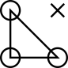

 Welcome to Locan
==================================================

Locan is a python-based library with code for analyzing fluoresence super-resolution
microscopy data.

Getting Started
----------------

To install the package please read the [instructions](docs/source/installation.rst).

For details on usage and development please read the [documentation](docs/index.rst).

[Tutorials](docs/tutorials/tutorials.rst) are provided as Jupyter notebooks.

You can use the package in a docker container as described in [docker/README.md](docker/README.md).

Contributing
------------

Development takes place on the [Locan Github page](https://github.com/super-resolution/Locan).

Please read [development.rst](docs/source/development.rst) for details on how to help develop this project further.

Developers
----------

See the list of [contributors](docs/source/contributions.rst) who participated in this project.

License
-------

This project is licensed under the BSD-3 License - see the [LICENSE](LICENSE.md) file for details.

Citing
-------

If you want to acknowledge locan please cite this repository using the DOI provided by zenodo:

    to be added

Note this DOI will resolve to all versions of locan. 
To cite a specific version please find the DOI of that version on the zenodo page. 
